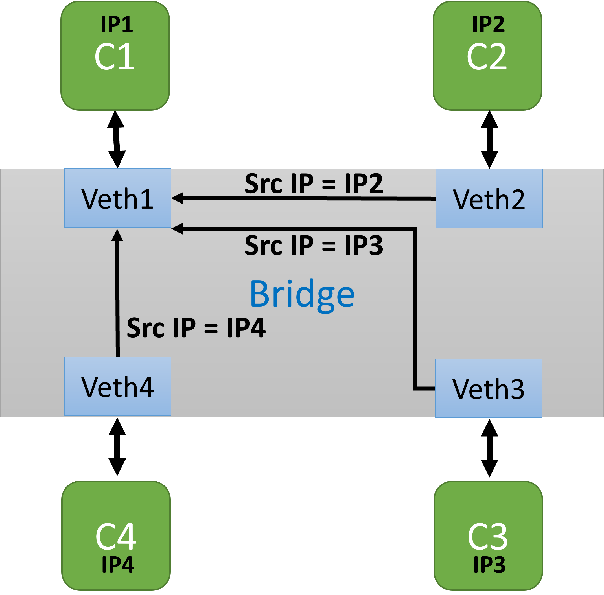
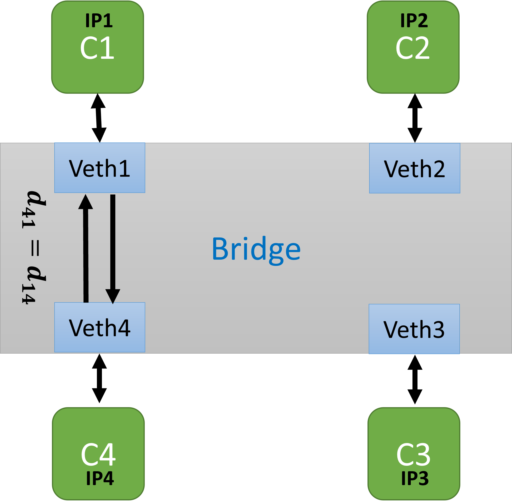

# Docker-bridge-delay-BW-control

## Motivation
If you have multiple docker containers connected together through a bridge, then using this sample script, you can modify the delays from one container to another with `linux traffic controller (tc)`" [[1]](#1). This control is done inside the bridge and not from the inside of the containers which is useful if you do not want to touch the containers. It is also possible to control the `Bandwidth` as well.

## Introduction
CBQ and HTB are two of the classful qdiscs in tc. CBQ (Class Based Queueing) is a classful qdisc that implements a rich linksharing hierarchy of classes. It contains shaping elements as well as prioritizing capabilities. Shaping is performed using link idle time calculations based on the timing of dequeue events and underlying link bandwidth" [[2]](#2). HTB is meant as a more understandable and intuitive replacement for the CBQ qdisc in Linux. Both CBQ and HTB help you to control the use of the outbound bandwidth on a given link. Both allow you to use one physical link to simulate several slower links and to send different kinds of traffic on different simulated links. In both cases, you have to specify how to divide the physical link into simulated links and how to decide which simulated link to use for a given packet to be sent. Unlike CBQ, HTB shapes traffic based on the Token Bucket Filter algorithm which does not depend on interface characteristics and so does not need to know the underlying bandwidth of the outgoing interface" [[3]](#3).

The controll of the delay from `container A` towards `container B` can be done in `VethX` which is connecting the `container B` (destination container) to the bridge. So, for applying the different delays for data coming from different source containers, it is needed to distinguish between the source of the data in `VethX`. As every container has an IP address, this can be done through filtering the source IP address of the sender.

A simple structure with internal view of `VethX` a bridge and the containers is demonstrated here: 

<p align="middle">
  
   
</p>

## Schematic of the structure of the classes, qdiscs and filters
  ```bash
  #   (f) --<<          1:0            root handle 1:0 cbq|htb "qdisc"  
  #   (i) |              |                                           
  #   (l) |             1:1            classid 1:1 cbq|htb "class"
  #   (t) |            /   \
  #   (e) |           /     \
  #   (r) -->>     1:2      1:3   ...  leaf classes
  #                 |        |
  #                20:       30:  ...  leaf qdiscs
  #              (netem     (netem
  #              delay)     delay)
  ```

## Using the script

You can use the scripts in two ways:

A. Starting a test structure using    
  ```bash
  sudo DBDelay.sh test X [cbq|htb]
  ```
  Where `X` is the desired number of the containers. This will build a network called `testNet` with a bridge named `myTestNet` and the containers named `Client1` to `ClientX`.  It will ask for each container the total bandwidth it accepts from the bridge (through VethX), the delay and the bandwidth regarding every other container towards this one.
  You need to select between `cbq` and `htb`.
  
  In this case, after fininishing your tests, you can clean the test structure using
  ```bash
  sudo DBDelay.sh clean X
  ``` 
B. Applying the script on an existing bridge. 
  1. Run the script as
  ```bash
  sudo DBDelay.sh modify BRIDGE_NAME
  ``` 
  Where ` BRIDGE_NAME` is the name of your bridge that you want to apply your desired delay and bandwith control (use `docker network ls` in case you do not remember the bridge name). It will ask for each container the total bandwidth it accepts from the bridge (through `VethX`), the delay and the bandwidth regarding every other container towards this one. 
  
  ## Important ##
  Do not forget to use symmetric delays between each pair of containers and keep in mind that sum of the total bandwidth assigned to flows crossing `VethX` should not exceed the main bandwidth assigned tio this `VethX`. Also, sum of the total bandwidth in the bridge should be less than `1/10` of the available system bandwidth.
  
  ## References
<a id="1">[1]</a> 
https://man7.org/linux/man-pages/man8/tc.8.html 
tc(8) — Linux manual page

<a id="2">[2]</a> 
https://man7.org/linux/man-pages/man8/tc-cbq-details.8.html. 
tc-cbq-details(8) — Linux manual page

<a id="3">[3]</a> 
http://luxik.cdi.cz/~devik/qos/htb/manual/userg.htm
HTB Linux queuing discipline manual - user guide.
